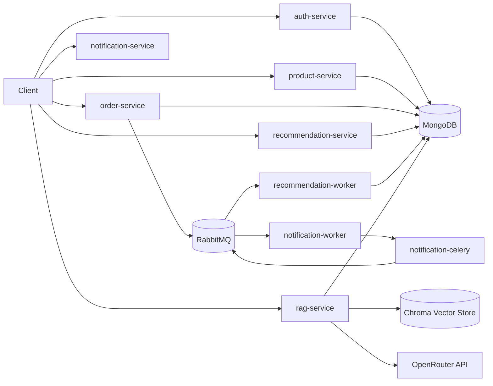
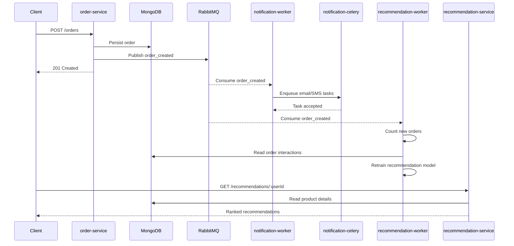

# Shop Nexus Core

Shop Nexus Core is a microservices-based e-commerce backend focused on authentication, catalog management, order processing, asynchronous notifications, personalized product recommendations, and a dedicated catalog RAG assistant.

The platform combines:

- Go services for authentication, catalog, and order workflows.
- Python services for notifications, recommendation training, and a dedicated RAG microservice.
- MongoDB as the operational database.
- RabbitMQ for asynchronous event-driven integration.
- Celery for background notification dispatch.

## Current Scope

- User registration and login with JWT authentication.
- Product and category management.
- Order creation with payment simulation and event publishing.
- Notification pipeline triggered by order events.
- Recommendation engine based on collaborative filtering with popular-product fallback.
- Optional catalog RAG assistant using OpenRouter free models through a dedicated microservice.

## System Purpose

The project serves two complementary recommendation use cases over the same commerce catalog:

- Behavioral recommendation with machine learning through recommendation-service.
- Grounded semantic catalog assistance through rag-service.

They are related, but they are not the same runtime path:

- recommendation-service uses historical order interactions from MongoDB to rank products for a user.
- rag-service uses catalog documents, embeddings, a vector database, and an LLM-compatible endpoint to answer natural-language product questions.
- product-service is the shared source of catalog truth for both approaches.
- order-service produces the events and interaction data that make retraining possible.
- notification-service reacts to the same order events for asynchronous customer communication.
- auth-service protects user-bound workflows with JWT authentication.

Today, ML and RAG are exposed as separate APIs. A frontend or gateway can combine them into a single recommendation experience, for example by using ML for ranking and RAG for explanation, discovery, or follow-up catalog questions.

## Architecture



## How The Services Connect

1. auth-service issues JWT tokens used by protected catalog and order operations.
	It can also verify Google ID tokens when GOOGLE_CLIENT_ID is configured.
2. product-service manages products and categories stored in MongoDB.
3. order-service creates orders, simulates payment, persists them in MongoDB, and publishes order_created to RabbitMQ.
	Events now use an explicit order.created envelope with correlation_id support for cross-service tracing.
4. recommendation-worker consumes order_created events and retrains the ALS model after a configurable number of orders.
5. recommendation-service loads the persisted model artifact and returns personalized recommendations.
6. notification-worker consumes the same order_created event and schedules Celery tasks for notifications.
7. notification-celery executes those asynchronous notification tasks.
8. rag-service reads the catalog from MongoDB, indexes it into Chroma, and uses OpenRouter only when generative answers are enabled.

## Order Event Sequence



## Services

### auth-service

- Language: Go
- Responsibility: registration, login, JWT issuance, user lookup
- Port: 8000
- Main libraries: Gin, gin-contrib/cors, golang-jwt/jwt/v5, MongoDB Go driver, ulule/limiter

Endpoints:

- GET /health
- POST /auth/register
- POST /auth/login
- POST /auth/google
- GET /users/:id

### product-service

- Language: Go
- Responsibility: product and category CRUD
- Port: 8001
- Main libraries: Gin, gin-contrib/cors, MongoDB Go driver, ulule/limiter

Endpoints:

- GET /health
- GET /products
- GET /products/:id
- POST /products
- PUT /products/:id
- DELETE /products/:id
- GET /categories
- POST /categories

### order-service

- Language: Go
- Responsibility: create and read orders, simulate payment, publish order events
- Port: 8002
- Main libraries: Gin, MongoDB Go driver, streadway/amqp, ulule/limiter

Endpoints:

- GET /health
- POST /orders
- GET /orders
- GET /orders/:id

### recommendation-service

- Language: Python
- Responsibility: serve recommendations and expose model health
- Port: 8003
- Main libraries: Flask, Gunicorn, Pika, PyMongo, implicit ALS, scipy sparse matrices, joblib

Internal layering:

- API layer for routes and validation
- Service layer for model training, ranking, and health
- Client layer for RabbitMQ connectivity
- Worker layer for asynchronous retraining
- Core layer for configuration and MongoDB access

Endpoints:

- GET /recommendations/:userId?limit=5
- POST /recommendations/train
- GET /recommendations/evaluation
- GET /recommendations/artifacts
- POST /recommendations/rollback
- GET /health

### rag-service

- Language: Python
- Responsibility: index catalog data into a vector store and answer grounded catalog questions
- Port: 8005
- Main libraries: Flask, LangChain, langchain-openai, langchain-chroma, FastEmbed, ChromaDB, PyMongo

Internal layering:

- API layer for routes and request validation
- Service layer for orchestration, indexing, and health
- Repository layer for catalog reads from MongoDB
- Client layer for OpenRouter integration
- Core layer for configuration and infrastructure

Endpoints:

- GET /health
- POST /catalog/index
- POST /rag/query

### notification-service

- Language: Python
- Responsibility: expose health status for notification infrastructure
- Port: 8004
- Main libraries: Flask, Celery, Pika

Internal layering:

- API layer for routes
- Service layer for health and event orchestration
- Client layer for RabbitMQ connectivity
- Task layer for Celery jobs
- Worker layer for background consumption
- Core layer for configuration and logging

Endpoints:

- GET /health

### notification-worker

- Language: Python
- Responsibility: consume order_created events and enqueue Celery jobs

### notification-celery

- Language: Python
- Responsibility: execute background notification tasks

### recommendation-worker

- Language: Python
- Responsibility: consume order_created events and retrain the model on a configurable interval

## Recommendation Strategy

The recommendation engine currently uses implicit collaborative filtering with ALS.

Implemented hardening:

- Sparse interaction matrix instead of dense numpy arrays.
- Model artifact persistence on a shared Docker volume.
- Versioned model artifact registry with retention and rollback support.
- Popular-product fallback for cold-start users and empty models.
- Hybrid ranking that blends collaborative filtering, product popularity, and per-user category affinity.
- Training metadata in the model artifact for observability.
- Offline evaluation metrics persisted with the model artifact, including precision, recall, coverage, hit rate, and MRR.
- Dedicated worker that retrains asynchronously from order events.
- Explicit order.created event envelopes with correlation IDs for safer inter-service contracts.

Remaining improvements recommended for production:

- Add a scheduled retraining policy in addition to event-count retraining.
- Introduce more business-aware ranking rules such as freshness, stock, or promotion boosts.
- Add explicit feature logging for model observability.
- Add MAP@K and NDCG if ranking-quality analysis needs to become stricter.

## Catalog RAG with OpenRouter

The repository now includes a dedicated rag-service instead of mixing retrieval and generation into recommendation-service.

How it works:

- Read product and category records from MongoDB.
- Embed catalog documents using LangChain plus FastEmbed.
- Persist vectors in a local Chroma store mounted as a Docker volume.
- Retrieve relevant product documents for each question.
- If OPENROUTER_API_KEY is configured, generate a grounded answer with an OpenRouter free model.
- If no API key is provided, return retrieval-only results without generation.

Current implementation details:

- Document construction is handled in a dedicated service that transforms MongoDB product and category records into LangChain documents.
- Vector storage is implemented with ChromaDB persisted on a Docker volume.
- Embeddings are generated with FastEmbed.
- Generation uses an OpenAI-compatible client through langchain-openai against the OpenRouter base URL.
- The service gracefully degrades to retrieval_only mode when no API key is configured or when no relevant sources are found.

Current endpoint:

- POST /rag/query

Example request:

```json
{
	"query": "Which products are best for a home office setup?",
	"top_k": 5
}
```

Current operational endpoint for index rebuild:

- POST /catalog/index

Recommended next RAG upgrades:

- Add automatic index refresh on product and category changes.
- Add category, price, and stock metadata filters.
- Introduce answer citations and structured product cards.
- Cache retrieval results for frequent queries.
- Add conversational memory only if a real multi-turn assistant is required.
- Move from local Chroma to Qdrant or Weaviate when horizontal scale becomes necessary.

## Docker Compose

The compose stack is designed to run all operational components:

- auth-service
- product-service
- order-service
- recommendation-service
- recommendation-worker
- rag-service
- notification-service
- notification-worker
- notification-celery
- rabbitmq
- mongo

Start the full stack:

```bash
docker compose up --build
```

Infrastructure details:

- RabbitMQ runs as rabbitmq:3-management with AMQP on port 5672 and the management UI on port 15672.
- MongoDB runs as mongo:6.0 with a persistent docker volume.
- Go services use binary healthchecks.
- Python API services use HTTP healthchecks against their local /health endpoint.
- recommendation-service and recommendation-worker share the same model artifact volume.
- rag-service persists the vector index in its own Docker volume.

## Environment Variables

The repository now includes environment templates at two levels:

- Root [.env.example](c:/Users/Frrn/Desktop/Development/Dev_Golang_Python/shop-nexus-core/.env.example) for the full Docker Compose stack.
- Service-level templates for direct local execution:
- [auth-service/.env.example](c:/Users/Frrn/Desktop/Development/Dev_Golang_Python/shop-nexus-core/auth-service/.env.example)
- [product-service/.env.example](c:/Users/Frrn/Desktop/Development/Dev_Golang_Python/shop-nexus-core/product-service/.env.example)
- [order-service/.env.example](c:/Users/Frrn/Desktop/Development/Dev_Golang_Python/shop-nexus-core/order-service/.env.example)
- [notification-service/.env.example](c:/Users/Frrn/Desktop/Development/Dev_Golang_Python/shop-nexus-core/notification-service/.env.example)
- [recommendation-service/.env.example](c:/Users/Frrn/Desktop/Development/Dev_Golang_Python/shop-nexus-core/recommendation-service/.env.example)
- [rag-service/.env.example](c:/Users/Frrn/Desktop/Development/Dev_Golang_Python/shop-nexus-core/rag-service/.env.example)

Use the root template when running docker compose, and use each service template when running a service directly from its own folder.

Shared variables used across the platform:

- MONGODB_URI
- DB_NAME
- JWT_SECRET
- ALLOWED_ORIGINS
- RATE_LIMIT
- TOKEN_EXPIRATION
- RABBITMQ_URI
- CELERY_BROKER_URL
- CELERY_RESULT_BACKEND
- ORDER_EVENTS_EXCHANGE
- ORDER_EVENTS_QUEUE
- ORDER_EVENTS_ROUTING_KEY
- LOG_LEVEL
- RABBITMQ_HOST
- RABBITMQ_PORT
- RABBITMQ_USER
- RABBITMQ_PASS
- RABBITMQ_HEARTBEAT
- RABBITMQ_RETRY_DELAY
- RABBITMQ_MAX_RETRIES
- NOTIFICATION_EMAIL_DOMAIN
- NOTIFICATION_PHONE_DEFAULT
- TRAIN_INTERVAL
- MODEL_PATH
- MODEL_REGISTRY_DIR
- MODEL_VERSIONS_TO_KEEP
- MODEL_FACTORS
- MODEL_ITERATIONS
- MODEL_REGULARIZATION
- MODEL_ALPHA
- POPULAR_FALLBACK_SIZE
- RAG_PORT
- CHROMA_PERSIST_DIRECTORY
- CHROMA_COLLECTION_NAME
- EMBEDDING_MODEL
- RAG_TOP_K
- MONGO_MAX_POOL_SIZE
- MONGO_SERVER_SELECTION_TIMEOUT_MS
- MONGO_CONNECT_TIMEOUT_MS
- MONGO_SOCKET_TIMEOUT_MS

Optional OpenRouter variables:

- OPENROUTER_API_KEY
- OPENROUTER_MODEL
- OPENROUTER_BASE_URL
- OPENROUTER_REFERER
- OPENROUTER_APP_NAME

## Engineering Notes

Current improvements already applied in the codebase include:

- Cleaner separation of responsibilities between HTTP handlers and event publishing.
- Request ID propagation through the Go HTTP services via X-Request-ID.
- Safer JWT parsing and token TTL configuration.
- Better MongoDB connection error propagation.
- A reusable RabbitMQ publisher abstraction.
- A versioned event envelope for order.created with backward-compatible Python consumers.
- More resilient consumer acknowledgment flow.
- Clearer service boundaries between recommendation ranking and RAG.
- A Docker-managed persistent vector store for catalog retrieval.
- English-first messages for the updated paths.

Still recommended:

- Add unit and integration tests across services.
- Move shared event contracts to a versioned schema.
- Add tracing, correlation IDs, and structured logging.
- Add database indexes explicitly for common query paths.
- Replace simulated payment and notifications with real providers behind interfaces.
- Add automated regression checks for ranking quality and broader end-to-end tests.

## Status

The repository is now closer to an executable development platform, but it is not yet a fully production-ready commerce system. The main remaining gaps are automated tests, end-to-end validation, stronger observability, and deeper recommendation evaluation.