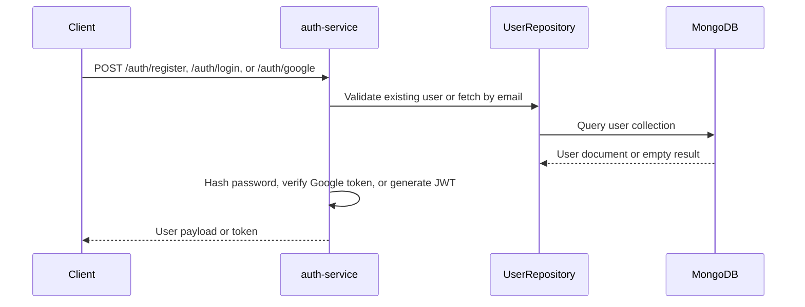

# Authentication Service

Go service responsible for user registration, login, JWT issuance, and protected user lookup.

## Purpose

This service is the authentication boundary of the platform.

- Registers users in MongoDB.
- Validates credentials with bcrypt.
- Issues JWT tokens with configurable TTL.
- Optionally supports Google Sign-In through verified Google ID tokens.
- Exposes a protected user lookup endpoint.
- Provides a binary and HTTP healthcheck path for Docker Compose.

## Implementation

- Language: Go 1.24
- HTTP framework: Gin
- Persistence: MongoDB
- Authentication: JWT via golang-jwt/jwt/v5
- Optional OAuth identity verification: Google ID token validation
- Security middleware: CORS, security headers, rate limiter, auth middleware

Internal responsibilities:

- cmd/main.go: application bootstrap and dependency wiring
- internal/handlers: HTTP handlers and health endpoint
- internal/repository: MongoDB user persistence
- internal/utils/jwt: token generation helpers
- pkg/database: MongoDB client helper
- pkg/middleware: auth, security, and rate limiting

## Request Flow



Main endpoints:

- GET /health
- POST /auth/register
- POST /auth/login
- POST /auth/google
- GET /users/:id

Endpoint notes:

- GET /health: public health endpoint used by Compose supervision.
- POST /auth/register: validates input, hashes the password, and creates the user.
- POST /auth/login: validates credentials and returns a signed JWT.
- POST /auth/google: verifies a Google ID token and returns a platform JWT.
- GET /users/:id: protected endpoint behind Bearer authentication.

Key environment variables:

- MONGODB_URI
- DB_NAME
- JWT_SECRET
- GOOGLE_CLIENT_ID
- PORT
- ALLOWED_ORIGINS
- RATE_LIMIT
- TOKEN_EXPIRATION

Environment template:

- Copy [auth-service/.env.example](c:/Users/Frrn/Desktop/Development/Dev_Golang_Python/shop-nexus-core/auth-service/.env.example) to a local `.env` when running the service directly.

Local run:

```bash
go run ./cmd/main.go
```

See the repository root README for the full architecture and operational workflow.