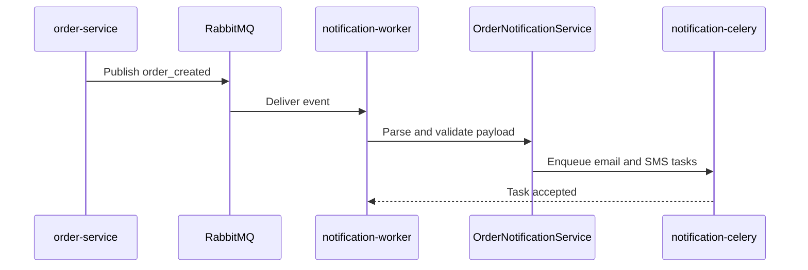

# Notification Service

Python service and workers responsible for notification health monitoring, order event consumption, and Celery task execution.

## Purpose

This service handles asynchronous notification orchestration.

- Exposes health information for RabbitMQ and Celery.
- Consumes order_created events from RabbitMQ.
- Supports both the explicit order.created event envelope and the legacy payload shape.
- Parses order payloads into notification tasks.
- Delegates background execution to Celery workers.

## Implementation

- Language: Python 3.11
- API stack: Flask
- Queue integration: RabbitMQ via Pika
- Background execution: Celery
- Runtime split: API process, event consumer, and Celery worker

Internal structure:

- app/api: HTTP routes
- app/clients: RabbitMQ infrastructure client
- app/core: configuration and logging setup
- app/services: health checks and notification orchestration
- app/tasks: Celery task definitions
- app/workers: background consumer runtime
- app/factory.py: dependency wiring and Flask app construction
- app/main.py: runtime entry point only

## Event Flow



Main API endpoint:

- GET /health

Endpoint notes:

- GET /health: reports RabbitMQ connectivity and Celery availability.

Operational processes:

- notification-service: API process
- notification-worker: RabbitMQ consumer
- notification-celery: Celery worker

Key environment variables:

- PORT
- RABBITMQ_URI
- CELERY_BROKER_URL
- CELERY_RESULT_BACKEND
- FLASK_ENV
- LOG_LEVEL

Environment template:

- Copy [notification-service/.env.example](c:/Users/Frrn/Desktop/Development/Dev_Golang_Python/shop-nexus-core/notification-service/.env.example) to a local `.env` when running the service directly.

Local run:

```bash
python -m app.main
```

Local worker processes:

```bash
python -m app.worker_consumer
celery -A app.tasks.notifications worker --loglevel=info
```

Dependencies:

- RabbitMQ for event intake
- Celery for deferred task execution
- Broker/result backend defined through environment configuration

See the repository root README for the full architecture and operational workflow.