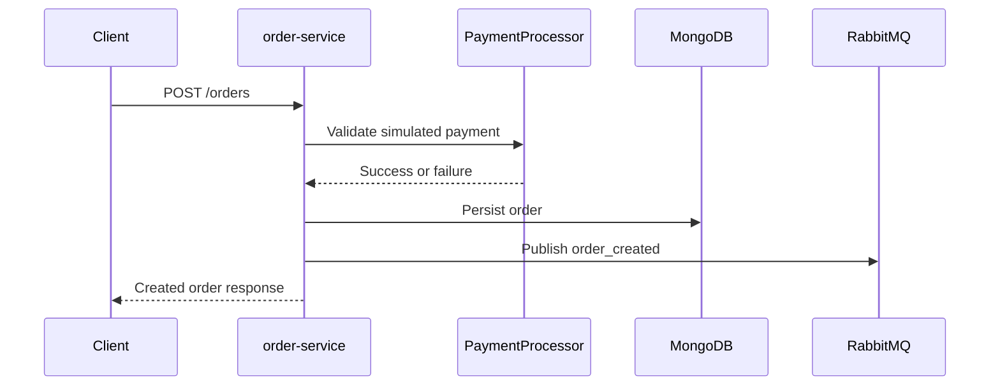

# Order Service

Go service responsible for order creation, payment simulation, and order event publication.

## Purpose

This service is the transactional bridge between the commerce domain and the asynchronous platform.

- Creates orders in MongoDB.
- Simulates payment approval.
- Publishes order_created events to RabbitMQ.
- Publishes an explicit order.created event envelope with correlation metadata.
- Feeds both notification-service and recommendation-service retraining.
- Exposes a public health endpoint and protected order endpoints.

## Implementation

- Language: Go 1.24
- HTTP framework: Gin
- Persistence: MongoDB
- Messaging: RabbitMQ via streadway/amqp
- Security: JWT-protected order routes, CORS, security headers, rate limiter

Internal responsibilities:

- cmd/main.go: bootstrap, wiring, and healthcheck mode
- internal/handlers: order HTTP handlers and health endpoint
- internal/handlers/events: RabbitMQ event publisher and order.created event contract
- internal/services/payment: payment simulation abstraction
- internal/repository: MongoDB order persistence
- pkg/database: MongoDB client helper
- pkg/middleware: auth, security, and throttling

## Event Flow



Main endpoints:

- GET /health
- POST /orders
- GET /orders
- GET /orders/:id

Endpoint notes:

- GET /health: public operational endpoint.
- POST /orders: protected endpoint that extracts the user from JWT claims.
- GET /orders and GET /orders/:id: protected order reads.

Tracing:

- Supports X-Request-ID on inbound requests.
- Generates a request ID when one is not provided.
- Propagates that value as correlation_id in the published order.created event.

Key environment variables:

- MONGODB_URI
- DB_NAME
- PORT
- RABBITMQ_URI
- JWT_SECRET
- ALLOWED_ORIGINS
- RATE_LIMIT

Environment template:

- Copy [order-service/.env.example](c:/Users/Frrn/Desktop/Development/Dev_Golang_Python/shop-nexus-core/order-service/.env.example) to a local `.env` when running the service directly.

Local run:

```bash
go run ./cmd/main.go
```

See the repository root README for the full architecture and operational workflow.