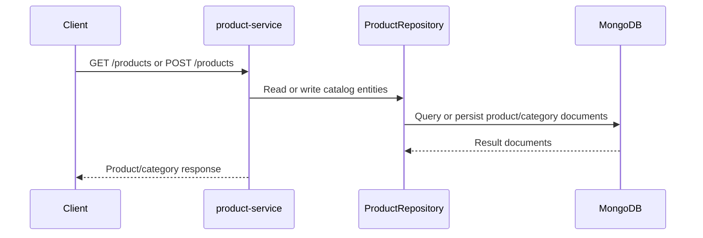

# Product Service

Go service responsible for product and category management.

## Purpose

This service is the catalog source of truth.

- Stores products and categories in MongoDB.
- Validates category references before product writes.
- Exposes the catalog consumed by the commerce flows, the ML recommender, and the RAG service.
- Provides public read endpoints and protected write endpoints.

## Implementation

- Language: Go 1.24
- HTTP framework: Gin
- Persistence: MongoDB
- Security: JWT-protected mutation routes, CORS, security headers, rate limiter

Internal responsibilities:

- cmd/main.go: bootstrap and wiring
- internal/handlers: product and category HTTP handlers plus health endpoint
- internal/repository: MongoDB access for products and categories
- internal/utils: request validation helpers
- pkg/database: MongoDB client helper
- pkg/middleware: auth, security, and throttling

## Request Flow



Main endpoints:

- GET /health
- GET /products
- GET /products/:id
- POST /products
- PUT /products/:id
- DELETE /products/:id
- GET /categories
- POST /categories

Endpoint notes:

- GET /health: public operational status endpoint.
- GET /products and GET /products/:id: public catalog reads.
- POST/PUT/DELETE /products: protected write operations.
- GET /categories: public category read.
- POST /categories: protected category creation.

Key environment variables:

- MONGODB_URI
- DB_NAME
- PORT
- JWT_SECRET
- ALLOWED_ORIGINS
- RATE_LIMIT

Environment template:

- Copy [product-service/.env.example](c:/Users/Frrn/Desktop/Development/Dev_Golang_Python/shop-nexus-core/product-service/.env.example) to a local `.env` when running the service directly.

Local run:

```bash
go run ./cmd/main.go
```

See the repository root README for the full architecture and operational workflow.