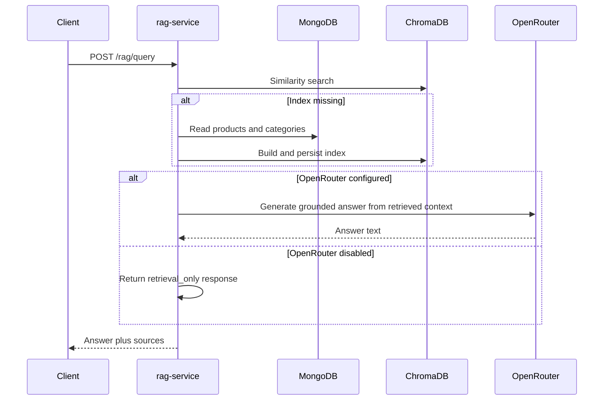
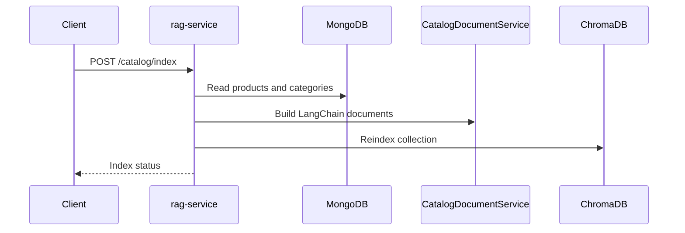

# RAG Service

Python microservice responsible for catalog retrieval-augmented generation.

## Purpose

This service answers catalog questions with grounded retrieval over the product catalog.

- Reads products and categories from MongoDB.
- Builds LangChain documents from catalog entities.
- Indexes them into a persisted Chroma vector store.
- Retrieves relevant sources for each question.
- Uses OpenRouter only when generative answering is enabled.

It complements recommendation-service but does not replace it:

- recommendation-service ranks products from behavioral data.
- rag-service explains and explores the catalog from natural language queries.

Responsibilities:

- Read product and category data from MongoDB.
- Build and persist a vector index using LangChain plus Chroma.
- Answer grounded catalog questions using OpenRouter free chat models.
- Expose operational endpoints for health and reindexing.

Internal structure:

- app/api: HTTP routes and request parsing
- app/clients: external LLM client integration
- app/core: configuration and database connectivity
- app/repositories: MongoDB data access
- app/services: document building, indexing, retrieval, orchestration, and health
- app/factory.py: dependency wiring and Flask app construction
- app/main.py: runtime entry point only

## Implementation

- Language: Python 3.11
- API stack: Flask + Gunicorn
- Retrieval framework: LangChain
- Vector database: ChromaDB through langchain-chroma
- Embeddings: FastEmbed
- LLM client: langchain-openai against the OpenRouter API
- Operational mode: graceful retrieval_only fallback when no API key is configured

## Query Flow



## Indexing Flow



Main endpoints:

- GET /health
- POST /catalog/index
- POST /rag/query

Endpoint notes:

- GET /health: reports MongoDB, vector store, and OpenRouter configuration state.
- POST /catalog/index: forces a rebuild of the persisted vector index.
- POST /rag/query: returns an answer and the retrieved catalog sources.

Key environment variables:

- PORT
- MONGODB_URI
- DB_NAME
- CHROMA_PERSIST_DIRECTORY
- EMBEDDING_MODEL
- OPENROUTER_API_KEY
- OPENROUTER_MODEL
- OPENROUTER_REFERER
- OPENROUTER_APP_NAME

Environment template:

- Copy [rag-service/.env.example](c:/Users/Frrn/Desktop/Development/Dev_Golang_Python/shop-nexus-core/rag-service/.env.example) to a local `.env` when running the service directly.

Local run:

```bash
python -m app.main
```

Dependencies:

- MongoDB for source catalog data
- rag-data Docker volume for the persisted Chroma index
- OpenRouter for optional grounded generation

See the repository root README for the full architecture and operational workflow.