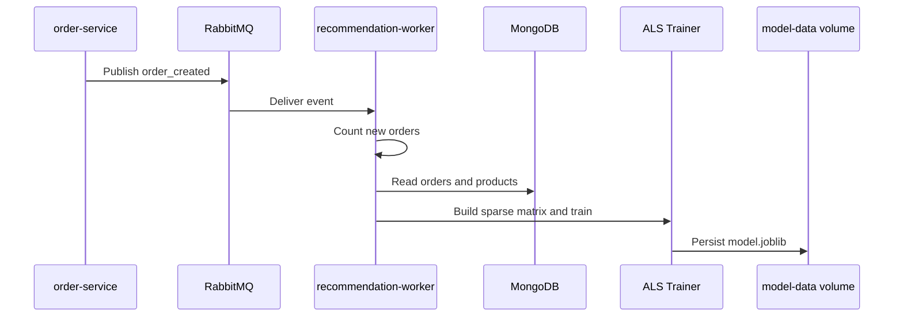
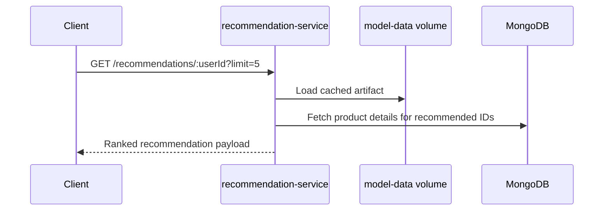

# Recommendation Service

Python service and worker responsible for serving recommendations and retraining the ALS model.

## Purpose

This service is the machine-learning recommendation engine of the platform.

- Reads historical order interactions from MongoDB.
- Trains an implicit-feedback ALS model.
- Persists the trained artifact to shared storage.
- Serves personalized recommendations through an HTTP API.
- Retrains asynchronously from RabbitMQ order_created events.
- Accepts both the explicit order.created event envelope and the legacy payload shape during worker consumption.

Internal structure:

- app/api: HTTP routes and request parsing
- app/clients: RabbitMQ infrastructure client
- app/core: configuration and MongoDB connectivity
- app/services: model training, recommendation projection, and health
- app/workers: background retraining consumer
- app/factory.py: dependency wiring and Flask app construction
- app/main.py: runtime entry point only

## Implementation

- Language: Python 3.11
- API stack: Flask + Gunicorn
- Messaging: RabbitMQ via Pika
- Persistence: MongoDB
- ML stack: implicit ALS, scipy sparse matrices, numpy, joblib
- Model behavior: hybrid ranking that blends collaborative filtering, popularity, and category affinity

## Training Flow



## Serving Flow



Main endpoints:

- GET /recommendations/:userId
- POST /recommendations/train
- GET /recommendations/evaluation
- GET /recommendations/artifacts
- POST /recommendations/rollback
- GET /health

Endpoint notes:

- GET /recommendations/:userId: returns recommendation candidates enriched with product data.
- POST /recommendations/train: triggers immediate training.
- GET /recommendations/evaluation: exposes current offline metrics and artifact metadata.
- GET /recommendations/artifacts: lists stored model artifacts and the active artifact.
- POST /recommendations/rollback: switches the active model back to a previous artifact version.
- GET /health: reports MongoDB and model readiness.

Operational processes:

- recommendation-service: HTTP API
- recommendation-worker: RabbitMQ consumer and trainer

Key environment variables:

- PORT
- MONGODB_URI
- DB_NAME
- RABBITMQ_URI
- MODEL_PATH
- MODEL_REGISTRY_DIR
- MODEL_VERSIONS_TO_KEEP
- TRAIN_INTERVAL
- EVALUATION_TOP_K

Environment template:

- Copy [recommendation-service/.env.example](c:/Users/Frrn/Desktop/Development/Dev_Golang_Python/shop-nexus-core/recommendation-service/.env.example) to a local `.env` when running the service directly.

Local run:

```bash
python -m app.main
```

Local worker process:

```bash
python -m app.worker_consumer
```

Model artifact details:

- Persists versioned model artifacts with a manifest-backed registry
- Supports rollback to a previous trained artifact
- Stores ranking weights used by the hybrid scorer
- Exposes precision, recall, coverage, hit rate, and MRR through the evaluation endpoint

Dependencies:

- MongoDB for order interactions and product metadata
- RabbitMQ for retraining triggers
- Shared model-data volume for persisted artifacts

Validation:

- Run unit tests with: python -m unittest discover -s tests -v

See the repository root README for the full architecture and operational workflow.